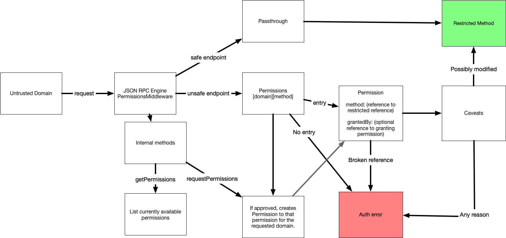

# JSON RPC Capabilities Middleware

A module for managing basic [capability-based security](https://en.wikipedia.org/wiki/Capability-based_security) over a [JSON-RPC API](https://www.jsonrpc.org/) as a middleware function for [json-rpc-engine](https://www.npmjs.com/package/json-rpc-engine).

For an intro to capability based security and why it makes sense, [we recommend this video](https://www.youtube.com/watch?v=2H-Azm8tM24).

This is an MVP capabilities system, with certain usage assumptions:

The consuming context is able to provide a `domain` to the middleware that is pre-authenticated. The library does not handle authentication, and trusts the `domain` parameter to the `providerMiddlewareFunction` is accurate and has been verified. (This was made initially as an MVP for proposing a simple capabilities system around [the MetaMask provider API](https://metamask.github.io/metamask-docs/API_Reference/Ethereum_Provider)).

This means the capabilities are not valuable without a connection to the granting server, which is definitely fairly acceptable for many contexts (just not like, issuing capabilities intended for redemption in a cryptographically verified smart contract).



## Installation

`npm install json-rpc-capabilities-middleware`

## Usage

The capability system is initialized with a variety of options, and is itself a [gaba](https://github.com/MetaMask/gaba/) compatible controller.

Once initialized, it exposes a special [AuthenticatedJsonRpcMiddleware](https://github.com/MetaMask/json-rpc-capabilities-middleware/blob/master/src/%40types/index.d.ts#L7-L15) type method `providerMiddlewareFunction(domain, req, res, next, end)`, which requires an assumed-authenticated `domain` object, followed by normal `json-rpc-engine` middleware parameters.

It simply passes through methods that are listed in the `safeMethods` array, but otherwise requires the requesting domain to have a permissions object, either granted by user, by approval on request, or (Soon<sup>TM</sup>) by delegation from another domain that has the desired permission.

This module uses TypeScript, and so referring to the `.d.ts` files for interface definitions could be helpful. The tests are also demonstrative.

```javascript
const Engine = require('json-rpc-engine')
const CapabilitiesController = require('json-rpc-capabilities-middleware')

const capabilitiesConfig = {

  // Supports passthrough methods:
  safeMethods: ['get_index']

  // optional prefix for internal methods
  methodPrefix: 'wallet_',

  restrictedMethods: {

    // Restricted methods themselves are defined as
    // json-rpc-engine middleware functions.
  'send_money': {
    description: 'Allows sending your money away freely.',
      method: (req, res, next, end) => {
        sendMoney()
        res.result = 'Success!'
        end()
      }
    },
  },

  /**
  * A promise-returning callback used to determine whether to approve
  * permissions requests or not.
  *
  * Currently only returns a boolean, but eventually should return any specific parameters or amendments to the permissions.
  *
  * @param {string} domain - The requesting domain string
  * @param {string} req - The request object sent in to the `requestPermissions` method.
  * @returns {Promise<bool>} approved - Whether the user approves the request or not.
  */
  requestUserApproval: async (domainInfo, req) => {
    const ok = await checkIfUserTrusts(domainInfo, req)
    return ok
  }
}

// Same state that is emitted from `this.store.subscribe((state) => {})`,
// Following the `obs-store` module framework.
// can be used to re-instantiate:
const restoredState = getPersistedState()

const capabilities = new CapabilitiesController(capabilitiesConfig, restoredState)

// Unlike normal json-rpc-engine middleware, these methods all require
// a unique requesting-domain-string as the first argument.
const domain = 'requestor.thatsite.com'
engine.push(capabilities.providerMiddlewareFunction.bind(capabilities, domain))
engine.start()
```

### Testing

To run unit tests: `npm run build && npm run test`

To test against an example dapp, serve the example using `npm run serve` and explore using [this branch of MetaMask](https://github.com/MetaMask/metamask-extension/tree/LoginPerSite).

## Internal RPC Methods

The capabilities system adds new methods to the RPC, and you can modify their names with the `methodPrefix` contructor param:

- getPermissions () - Returns the available (otherwise restricted) capabilities for the domain.
- requestPermissions (options) - Triggers the authorization flow, probably prompting user response, and creating the requested permissions objects if approved.

## Object Definitions

### Permissions Object

```
{
  @context: [ // always present per the standard, but can be ignored for the moment
    "https://github.com/MetaMask/json-rpc-capabilities-middleware"
  ],
  date: 1563743815289, // unix time of creation
  id: '63b225d0-414e-4a2d-8067-c34499c984c7', // UUID string
  invoker: 'exampledapp' // the domain of the dapp receiving the capability
  parentCapability: 'eth_accounts', // the name of the corresponding RPC method
  caveats: [ // an optional array of objects describing limitations on the method reference
    {
      type: 'filterResponse', // the filterResponse applies an exclusive filter to the RPC response
      value: ['0xabcde...'] // here, 'eth_accounts' can only return the single given account
    }
  ]
}
```

## Current Status

This module is in an exploratory MVP state and should not be used in production. It deserves more testing, scrutiny, consideration, and a healthy beta period before anyone should trust it with significant value.
